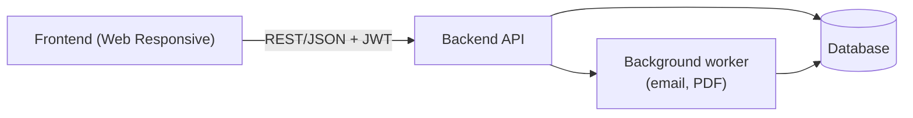

# Enterprise HR & Automated Payroll System

Hệ thống quản lý nhân sự doanh nghiệp và tính lương tự động (Topic 9, môn Công nghệ phần mềm).
Số hóa quy trình: hồ sơ nhân sự → chấm công/nghỉ phép → tính lương, thuế, bảo hiểm → xuất phiếu lương PDF,
thay cho quản lý thủ công bằng Excel.

> Các mục đánh dấu `TODO` là chỗ nhóm cần điền khi đã chốt công nghệ (xem `docs/ARCHITECTURE.md`).

## Tính năng

| Mức | Nội dung |
|---|---|
| **MVP (bắt buộc)** | Hồ sơ nhân sự và onboarding · Chấm công cơ bản · Nghỉ phép (PTO) kèm duyệt 1 cấp · Engine tính lương, bảo hiểm, thuế TNCN · Phiếu lương PDF · Xác thực JWT + phân quyền RBAC · Background worker gửi email/thông báo |
| **Mở rộng** | Tăng ca (OT) · Hợp đồng và cảnh báo hết hạn · Phụ cấp/khấu trừ · Cổng tự phục vụ (ESS) · Dashboard và báo cáo · Audit trail · Chấm công QR động + ảnh minh chứng |

Vai trò: `Employee`, `Manager`, `HR`, `Admin`. Chi tiết quyền: [docs/PERMISSION-MATRIX.md](docs/PERMISSION-MATRIX.md).

## Kiến trúc



- Frontend chỉ gọi Backend. Hợp đồng API nằm ở [docs/openapi-spec.yaml](docs/openapi-spec.yaml) (Contract-First, đổi API phải sửa file này trước, qua Pull Request).
- Tham số pháp luật (biểu thuế, tỷ lệ bảo hiểm, hệ số OT) lưu trong cấu hình theo ngày hiệu lực, không hard-code.

Công nghệ: `TODO` (backend / frontend / database / worker / PDF).

## Chạy trên máy

Yêu cầu: Docker và Docker Compose.

```bash
cp .env.example .env          # điền các biến còn trống (TODO)
docker compose up -d --build
```

| Dịch vụ | Địa chỉ |
|---|---|
| Web | `TODO http://localhost:<port>` |
| API | `TODO http://localhost:<port>/api/v1` |
| Tài liệu API | `TODO` (render từ `docs/openapi-spec.yaml`) |

Nạp dữ liệu demo: `TODO <lệnh seed>` (gồm tài khoản 4 vai trò, phòng ban, biểu thuế, bảo hiểm và bộ 500 nhân viên để kiểm tra hiệu năng).

Tài khoản demo (mật khẩu `TODO`):

| Vai trò | Email |
|---|---|
| Admin | `admin@example.com` |
| HR | `hr@example.com` |
| Manager | `manager@example.com` |
| Employee | `employee1@example.com` |

Lệnh hay dùng:

```bash
docker compose logs -f backend   # xem log
docker compose down              # tắt, giữ dữ liệu
docker compose down -v           # tắt và XÓA dữ liệu
```

## Kiểm thử

| Lệnh | Phạm vi |
|---|---|
| `TODO <unit test backend>` | Unit test, mục tiêu coverage ≥ 60% (ưu tiên engine lương, thuế, bảo hiểm, OT, workflow duyệt) |
| `TODO <integration test>` | Phân quyền theo ma trận, cách ly dữ liệu giữa nhân viên |
| `TODO npx playwright test` | E2E: đăng nhập → tạo PTO → duyệt → tính lương → sinh phiếu lương PDF |

CI (GitHub Actions) tự chạy build và test khi mở Pull Request; không merge nếu test đỏ.

## Quy trình Git

- `main`: nhánh ổn định, chỉ cập nhật qua Pull Request.
- Nhánh làm việc: `feature/<mã-FR>-<mô-tả>`, `fix/<mô-tả>`, `docs/<mô-tả>`.
- Mỗi PR cần ít nhất 1 reviewer duyệt và CI xanh trước khi merge.
- Commit theo Conventional Commits: `feat(payroll): ...`, `fix(auth): ...`, `docs: ...`.
- Không commit secret: `.env` đã được ignore.

Chi tiết trong `CONTRIBUTING.md`.

## Tài liệu

| File | Nội dung |
|---|---|
| [docs/SRS.pdf](docs/SRS.pdf) | Đặc tả yêu cầu phần mềm |
| [docs/openapi-spec.yaml](docs/openapi-spec.yaml) | Hợp đồng API (OpenAPI 3.1) |
| [docs/PERMISSION-MATRIX.md](docs/PERMISSION-MATRIX.md) | Ma trận phân quyền vai trò × chức năng |
| [docs/PAYROLL-RULES.md](docs/PAYROLL-RULES.md) | Công thức lương, thuế, bảo hiểm, OT kèm ví dụ số |
| `docs/ERD.md` | Cơ sở dữ liệu |
| `docs/ARCHITECTURE.md` | Kiến trúc và quyết định công nghệ |
| `docs/TEST-PLAN.md` | Kế hoạch và kết quả kiểm thử |
| `docs/RTM.md` | Ma trận truy vết FR → API → test |
| `docs/DEPLOY.md` | Triển khai, backup/restore |
| `docs/sprints/` | Backlog, kế hoạch và retrospective từng sprint |

## Cấu trúc thư mục

```
Enterprise-HR-Payroll/
├── .github/            # workflows CI, PR template, CODEOWNERS
├── backend/            # API, service tính lương, worker
├── frontend/           # giao diện web
├── docker/             # Dockerfile từng dịch vụ
├── docs/               # tài liệu dự án
├── docker-compose.yml
├── .env.example
└── README.md
```

## Nhóm thực hiện

| MSSV | Họ tên | Phụ trách |
|---|---|---|
| 52400074 | Hồ Thị Gia Hân | `TODO` |
| 52400266 | Đặng Minh Hiếu | `TODO` |
| 52400267 | Trần Thị Lệ Hoa | `TODO` |
| 52400292 | Nguyễn Hoàng Phương Ngân | `TODO` |
| 52200021 | Hồ Vinh Quan | `TODO` |
